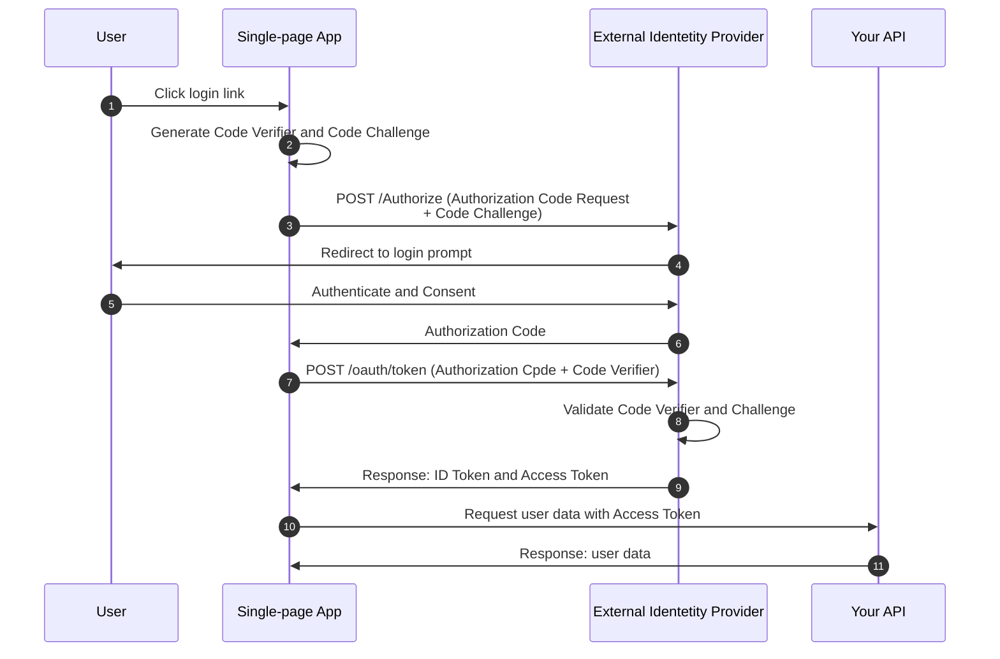

Before implementing our server-side architecture, it is essential to understand the underlying mechanics of the OAuth 2.0 Authorization Code flow. This article demonstrates how to configure an Identity Provider and highlights the inherent security limitations of client-side authentication.

# Setting up the Provider (Auth0)

Auth0 serves as the example provider, although the principles below apply to any OpenID Connect (OIDC)-compliant system.

- Application Configuration: Create a "Single Page Web Application" within the IdP dashboard.
- Callback URL: Set the Allowed Callback URL to `https://oauth.pstmn.io/v1/callback` to facilitate testing via Postman.
- API Definition: Navigate to the APIs section and define a new API. This establishes an Audience (e.g. `https://localhost:5001`), identifying the resource protected by the token.
- Authorization: Ensure the application is granted permission to request access tokens for the defined API.

Auth0 serves as the example provider, although the principles below apply to any OpenID Connect (OIDC)-compliant system.

# Testing the Flow with Postman

Postman provides an environment for simulating the browser-based OAuth 2.0 handshake. To begin, retrieve the metadata from the IdP discovery endpoint:

```bash
GET https://{{auth0_domain}}/.well-known/openid-configuration
```

From the response, extract the `authorization_endpoint` and `token_endpoint`.

Before configuring authentication, attempt to access the protected user information endpoint directly to confirm the lack of authorization:

```bash
GET https://{{auth0_domain}}/userinfo
```

This request will return a `401 Unauthorized status`, confirming the endpoint is properly protected.

To obtain a valid JWT, configure the authentication process within Postman. Navigate to the Authorization tab of your request and apply the following configuration:

| **Field**                 | **Value**                                          |
| ------------------------- | -------------------------------------------------- |
| Auth Type                 | OAuth 2.0                                          |
| Add authorization data to | Request headers                                    |
| Grant Type                | Authorization Code (With PKCE)                     |
| Callback URL              | https://oauth.pstmn.io/v1/callback                 |
| Authorize using browser   | Checked                                            |
| Auth URL                  | The authorization_endpoint from your discovery GET |
| Access Token URL          | The token_endpoint from your discovery GET         |
| Client ID                 | Found in your Auth0 Application Settings           |
| Client Secret             | Found in your Auth0 Application Settings           |
| Code Challenge Method     | SHA-256                                            |
| Scope                     | openid                                             |
| Audience                  | The API Identifier (e.g., https://localhost:5001)  |

Click **"Get New Access Token"** to initiate the browser-based login flow. Upon successful authentication, Postman will capture the JWT, which can then be used to perform authorized requests to the `/userinfo` endpoint.

<details>
<summary>Proof Key for Code Exchange (PKCE)</summary>
To mitigate the risk of authorization code interception, the Authorization Code flow employs Proof Key for Code Exchange (PKCE). PKCE adds a dynamically generated secret to the authentication handshake, ensuring that the client exchanging the authorization code for an access token is the same client that initiated the request.

The workflow, which draws from the standard [Auth0](https://auth0.com/docs/get-started/authentication-and-authorization-flow/authorization-code-flow-with-pkce) documentation, is illustrated below:



The PKCE Flow:

1. The user initiates the login process.
2. The application SDK generates a cryptographically random `code_verifier` and derives a `code_challenge` from it.
3. The application redirects the user to the Identity Provider's `/authorize` endpoint, including the `code_challenge`.
4. The Identity Provider redirects the user to the login and authorization prompt.
5. The user authenticates and provides consent for the requested permissions.
6. The Identity Provider stores the `code_challenge` and redirects the user back to the application with a single-use authorization code.
7. The application SDK sends the authorization code and the original `code_verifier` to the Identity Provider's `/oauth/token` endpoint.
8. The Identity Provider validates the `code_verifier` against the previously stored `code_challenge`.
9. Upon successful validation, the Identity Provider issues an ID token and access token.
10. The application utilizes the access token to request information from the protected API.
11. The API responds with the requested data.

## Why is PKCE essential?

The PKCE flow is a critical security enhancement for public clients (like SPAs and mobile apps) that cannot securely store a static client secret. Without PKCE, the Authorization Code flow is vulnerable to an authorization code interception attack.

If a malicious application on the user's device or an attacker-controlled browser extension intercepts the authorization code (for example, via a custom URI scheme), they could theoretically attempt to exchange that code for an access token.

PKCE prevents this by ensuring that the authorization code is cryptographically bound to the client that initiated the request:

- **The Verifier stays private:** The `code_verifier` is created by the legitimate application and is never transmitted during the initial authorization request.
- **The Proof is required:** The Identity Provider only issues an access token if the client can prove it possesses the original `code_verifier` that matches the code_challenge provided in step 3.

Because the attacker never sees the `code_verifier`, they cannot successfully complete the exchange at the `/oauth/token` endpoint. Even if they possess the intercepted authorization code, it is rendered useless, as they cannot provide the cryptographic proof required to validate it.

**Can an attacker reverse-engineer the secret?**

A common question is whether an attacker can calculate the `code_verifier` if they intercept the `code_challenge` during the initial request. The answer is no. The `code_challenge` is a one-way cryptographic hash (typically `SHA-256`). It acts as a digital fingerprint—it is easy to generate, but mathematically impossible to reverse.

Because the attacker never sees the raw `code_verifier` (the "pre-image"), they cannot successfully complete the exchange at the `/oauth/token` endpoint. Even if they possess the intercepted authorization code, it is rendered useless, as they cannot provide the cryptographic proof required to validate it.

</details>

# Inspecting the Token and Fetching UserInfo

The Access Token can be inspected via [jwt.io](https://jwt.io) to analyze the payload. A standard payload appears as follows:

```json
{
  "iss": "https://your-tenant.auth0.com/",
  "sub": "auth0|69eb8c721d4731384e6986df",
  "aud": ["https://localhost:5001", "https://your-tenant.auth0.com/userinfo"],
  "iat": 1777306957,
  "exp": 1777393357,
  "scope": "openid",
  "azp": "qXSWzTdQUzQ85t7VAL215FR2dnEc6bYG"
}
```

## The Impact of Scopes

The retrieved token contains only the claims explicitly requested during the handshake. If a GET request is performed to the UserInfo endpoint using this token, the response is minimal:

```json
{
  "sub": "auth0|111111111111111111111111"
}
```

By updating the Scope field in the Postman configuration to `openid profile email offline_access` and re-generating the token, the `UserInfo` response becomes significantly more descriptive:

```json
{
  "sub": "auth0|111111111111111111111111",
  "nickname": "etiennelabs",
  "name": "jelle@etiennelabs",
  "picture": "https://s.gravatar.com/...",
  "updated_at": "2026-04-27T15:13:23.224Z",
  "email": "jelle@etiennelabs",
  "email_verified": false
}
```

This granular control demonstrates the power of OIDC, but it also reveals a significant architectural risk.

# The Security Boundary: Handling Public Clients

During testing in Postman, we utilized both a Client ID and a Client Secret. However, in the context of a Single-Page Application (SPA) or mobile app, storing a Client Secret creates a critical security vulnerability.

In OAuth 2.0 terminology, browsers and mobile applications are classified as Public Clients. By definition, a public client is incapable of maintaining the confidentiality of a secret.

## The Danger of Client-Side Secrets

1. **Source Code Visibility:** Frontend code is effectively public. Any credentials embedded within this code are accessible to any user via browser developer tools.
2. **Network Interception:** Network traffic is visible. An attacker can inspect the "Network" tab in the browser to identify request headers and payloads sent to the IdP.
3. **Impersonation:** Once a Client Secret is compromised, an attacker can programmatically generate tokens on behalf of the application, bypassing all intended security controls.

As noted by standards such as OWASP and the emerging IETF OAuth 2.1 specification, relying on client-side secret storage is prohibited.

> "An SPA is deemed a public client since it cannot hold a secret. Such a secret would be part of the JavaScript loaded by the website and, thus, be accessible to anyone inspecting the source code." — [Best Practices: OAuth for Single Page Applications](https://curity.io/resources/learn/spa-best-practices/)

## The Secure Approach: Public Client Architecture

To keep the system secure, we rely on a stateless flow that does not require a client secret on the frontend:

- **Use PKCE:** The application uses Proof Key for Code Exchange (PKCE) to securely acquire tokens without using a static client secret.
- **Use In-Memory Token Storage:** The token is kept strictly in memory within the frontend state. It is never persisted to localStorage or disk.

- **Delegated Verification:** The .NET API verifies the token mathematically using the IdP's public key, ensuring that the API only accepts tokens issued to the correct audience.

# Conclusion

By understanding the distinction between public and confidential clients, we can build a stateless authentication architecture that is both flexible and secure. We avoid the vulnerability of storing static secrets on the frontend by using PKCE, and we protect against XSS attacks by utilizing in-memory storage for our tokens.

In the next part of this series, we will implement this architecture in both our .NET API and our React frontend, using OpenTelemetry to trace the validation process.
