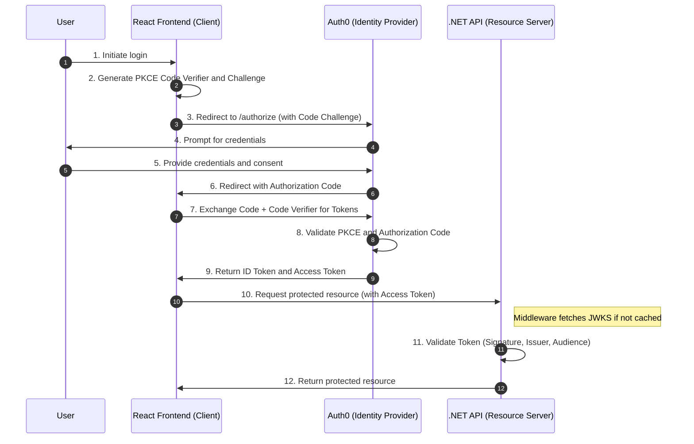

In the previous part of this series, we configured Auth0 as our external Identity Provider (IdP) and successfully retrieved a JWT access token using Postman. While Postman is excellent for verifying that our IdP is configured correctly, our users won't be using a console to access our data.

In this part, we move from manual testing to a fully functional application. We are going to build the "Bridge" between our Identity Provider and our users by setting up both a protected .NET API and a React Frontend.

The goal is to create a seamless authentication flow where:

- **The Back-end (.NET):** Acts as a secure Resource Server, validating incoming tokens and exposing protected data.
- **The Front-end (React):** Handles the user's login lifecycle, ensures the session persists across page refreshes, and securely communicates with our API.
- **The Observability Layer:** We will use OpenTelemetry and Jaeger to visualize the "silent handshake" that happens when our API talks to Auth0 to verify those tokens.

# How it works

The authentication and authorization process is based on the OAuth 2.0 Authorization Code Flow with Proof Key for Code Exchange (PKCE). This standard ensures that the exchange of credentials and tokens is secure, even in public clients like a Single-Page Application (SPA).

The following diagram illustrates the interaction between the user, the React frontend, the Identity Provider (Auth0), and the .NET API.



The process is divided into two primary stages: obtaining the identity and access tokens, followed by the authorization of requests to the backend.

## 1. The Authentication Process (Steps 1–9)

This stage utilizes the Authorization Code Flow with PKCE. Unlike the implicit flow, this approach does not return tokens directly in the URL fragment, which significantly reduces the risk of token leakage.

- **PKCE (Proof Key for Code Exchange):** In Step 2, the client generates a cryptographically random code_verifier and its transformed version, the code_challenge. The challenge is sent during the initial authorization request.
- **Authorization Code:** After successful authentication (Step 5), the Identity Provider returns a short-lived authorization code. This code is useless on its own.
- **Token Exchange:** In Step 7, the client exchanges the authorization code and the original code_verifier for the tokens. The IDP validates that the verifier matches the challenge sent in Step 3. This ensures that the client requesting the tokens is the same one that initiated the login.
- **Token Types:** The client receives an ID Token (containing user profile information) and an Access Token (a JWT intended for the API).

## 2. Resource Authorization (Steps 10–12)

Once the client has an Access Token, it can interact with the protected API.

- **Bearer Token:** The client includes the Access Token in the Authorization header using the Bearer scheme for every request to a protected endpoint.
- Token Validation: The .NET API acts as a Resource Server. It does not need to communicate with Auth0 for every request. Instead, it validates the JWT locally.
- **Discovery and JWKS:** To perform local validation, the API must know the IDP's public keys. Upon the first request (or at startup), the .NET middleware calls the OIDC Discovery Endpoint of the IDP to download the JSON Web Key Set (JWKS).
- Validation Criteria: The middleware ensures the token is mathematically valid (`signature`), has not expired (`exp`), was issued by the expected domain (`iss`), and was intended for this specific API (`aud`).

Once validated, the middleware populates the `ClaimsPrincipal`, allowing your application logic to access the user's unique identifier and permissions.

# Implementation

Now that we understand the flow of tokens and the "silent handshake" between our API and the Identity Provider, it is time to put it into practice. We will build this in two stages: first, the back-end, where we configure .NET to protect our resources, and second, the front-end, where we build the user interface to handle the login process.

To make the "invisible" parts of authentication visible, we will also integrate OpenTelemetry. This will allow us to use Jaeger to watch our API as it communicates with Auth0 to fetch security keys, giving us a transparent look at the lifecycle of an authenticated request.

## Back-end

Our .NET API's primary job is to be skeptical. It needs to receive a token, verify it hasn't been tampered with, and ensure it was issued specifically for this application. We will achieve this using the `Microsoft.AspNetCore.Authentication.JwtBearer` package.

### Basic setup

In the `Program.cs` below, we configure the authentication schemes and set up `OpenTelemetry` to export traces to Jaeger via the OTLP protocol.

```cs
using Authentication.Api.Endpoints;
using Microsoft.AspNetCore.Authentication.JwtBearer;

var builder = WebApplication.CreateBuilder(args);

builder.Services
    .AddAuthentication(options =>
    {
        options.DefaultAuthenticateScheme = JwtBearerDefaults.AuthenticationScheme;
        options.DefaultChallengeScheme = JwtBearerDefaults.AuthenticationScheme;
    })
    .AddJwtBearer(options =>
    {
        options.Authority = $"https://{builder.Configuration["Auth0:Domain"]}/";
        options.Audience = builder.Configuration["Auth0:Audience"];
    });

builder.Services.AddOpenTelemetry()
    .ConfigureResource(resource => resource.AddService("Authentication.Api"))
    .WithTracing(tracing =>
    {
        tracing
            .AddAspNetCoreInstrumentation()
            .AddHttpClientInstrumentation();

        tracing.AddOtlpExporter();
    });

builder.Services.AddAuthorization();
builder.Services.AddControllers();

var app = builder.Build();

app.UseAuthentication();
app.UseAuthorization();

app
    .MapGroup("api/")
    .MapAuthenticationEndpoints();

app.Run();
```

<details>
<summary>`AddJwtBearer` setup</summary>
Note that you can also setup the JwtBearer-config yourself like this:

```cs
builder.Services
    .AddAuthentication(options =>
    {
        options.DefaultAuthenticateScheme = JwtBearerDefaults.AuthenticationScheme;
        options.DefaultChallengeScheme = JwtBearerDefaults.AuthenticationScheme;
    })
    .AddJwtBearer(options =>
    {
        options.RequireHttpsMetadata = false;
        options.MetadataAddress = builder.Configuration["Auth0:MetadataAddress"];
        options.Audience = builder.Configuration["Auth0:Audience"];
        options.TokenValidationParameters = new TokenValidationParameters()
        {
            ValidateIssuer = true,
            ValidateAudience = true,
            ValidIssuer = builder.Configuration["Auth0:ValidIssuer"]
        };
    });
```

However, this is not recommended for most production scenarios. By manually defining `TokenValidationParameters` and the `MetadataAddress`, you are opting out of the automatic OIDC Discovery process. The primary risk here is Key Rotation. Security best practices dictate that Identity Providers like Auth0 rotate their signing keys periodically.

When you use the Authority property (as we did in our main example), the .NET middleware automatically monitors the discovery document and updates its internal cache when keys change. If you hardcode these parameters manually, your API will fail to validate new tokens the moment Auth0 rotates its keys, leading to immediate `401 Unauthorized` errors that require a code change and redeploy to fix.

</details>

### Defining the endpoints

To keep our `Program.cs` clean, we use an extension method to map our endpoints. We have a public endpoint accessible to everyone and a private endpoint that requires a valid token, enforced by `.RequireAuthorization()`.

```cs
using System.Security.Claims;

namespace Authentication.Api.Endpoints;

public static class AuthenticationEndpoints
{
    public static IEndpointRouteBuilder MapAuthenticationEndpoints(this IEndpointRouteBuilder builder)
    {
        builder.MapGet("public", GetPublic);

        builder.MapGet("private", GetPrivate)
            .RequireAuthorization();

        return builder;
    }

    private static IResult GetPublic()
    {
        return Results.Ok(new
        {
            Message = "You have reached the public API.",
            Timestamp = DateTime.UtcNow
        });
    }

    private static IResult GetPrivate(ClaimsPrincipal user)
    {
        var userId = user.FindFirst(ClaimTypes.NameIdentifier)?.Value;

        return Results.Ok(new
        {
            message = "This is a protected endpoint - authentication required!",
            userId = userId,
            allClaims = user.Claims.Select(c => new { c.Type, c.Value }),
            timestamp = DateTime.UtcNow
        });
    }
}
```

### Running Jaeger

To visualize how .NET interacts with Auth0, we need to run Jaeger. You can start the Jaeger "all-in-one" container using Docker with the following command:

```bash
docker run -d --name jaeger \
  -p 16686:16686 \
  -p 4317:4317 \
  jaegertracing/all-in-one:latest
```

We expose the following ports:

- Port 16686: The dashboard where you can view your traces.
- Port 4317: The gRPC receiver for OpenTelemetry data.

### Observing the "Silent Handshake"

Once the API and Jaeger are running, we can trigger the protected endpoint using the Access Token we obtained earlier:

```bash
curl --location 'https://localhost:5003/api/private' --header 'Authorization: ••••••'
```

When the very first authenticated request hits the API, the JwtBearer middleware realizes it doesn't yet have the public keys needed to verify the token's signature. As seen in the Jaeger trace below, the API automatically performs an outgoing HTTP call to Auth0's `.well-known/openid-configuration` and `jwks.json` endpoints.

<p align="center">
  
</p>

Because .NET caches these security keys in memory, a second request to the same endpoint looks entirely different. There is no outgoing call to Auth0; the validation happens locally and near-instantaneously.

<p align="center">
  
</p>

This demonstrates the efficiency of OIDC: we get the security of an external Identity Provider with the performance of local token validation.

## Front-end

Setting up the frontend is straightforward by utilizing the Auth0 React SDK, which encapsulates the complexity of token management and the PKCE flow.

### Setup entry point

First, we need to register the Auth0Provider in our entry point (`main.tsx` or `main.jsx`). This ensures that the authentication context is available throughout the application.

```ts
import { Auth0Provider } from '@auth0/auth0-react';
import { StrictMode } from 'react';
import { createRoot } from 'react-dom/client';
import App from './App.tsx';

createRoot(document.getElementById('root')!).render(
  <StrictMode>
    <Auth0Provider
      domain={import.meta.env.VITE_AUTH0_DOMAIN}
      clientId={import.meta.env.VITE_AUTH0_CLIENT_ID}
      authorizationParams={{
        redirect_uri: window.location.origin,
        audience: import.meta.env.VITE_AUTH0_ADIENCE,
        scope: 'openid profile email offline_access',
      }}
      useRefreshTokens={true}
      cacheLocation='localstorage'>
      <App />
    </Auth0Provider>
  </StrictMode>,
);
```

While storing tokens in localstorage traditionally posed an XSS risk, modern OAuth 2.0 standards allow this when combined with Refresh Token Rotation.

Every time a token is refreshed, the old refresh token is invalidated and a new one is issued. If an attacker steals a token and uses it, Auth0 detects the reuse and immediately invalidates the entire token family, protecting the user's account automatically. This approach allows the application to survive page refreshes and browser restarts without relying on third-party cookies, which are increasingly blocked by modern browsers.

Make sure you have these enabled in your IdP

### Configure Environment Variables

Before initializing the component, make sure your `.env` file in the root of your project contains the correct variables corresponding to the Auth0 configuration. This could be something like this:

```bash
VITE_AUTH0_DOMAIN=your-domain.auth0.com
VITE_AUTH0_CLIENT_ID=your-client-id
VITE_AUTH0_AUDIENCE=https://localhost:5003
```

**Note on Client Configuration:** Ensure that the application's Callback URL (e.g., `http://localhost:5173`), Logout URL, and Allowed Web Origins are added to the Auth0 dashboard for the correct environment.

### Implementation

In your `App.tsx` file, implement the login and retrieval logic using the `useAuth0` hook. We use `getAccessTokenSilently()` to retrieve the Bearer token for accessing our private .NET API.

```ts
import { useAuth0 } from '@auth0/auth0-react';
import { useState } from 'react';

function App() {
  const [apiUser, setApiUser] = useState<object | null>(null);

  const {
    isLoading, // Loading state, the SDK needs to reach Auth0 on load
    isAuthenticated,
    error,
    loginWithRedirect, // Starts the login flow
    logout: auth0Logout, // Starts the logout flow
    user, // User profile
    getAccessTokenSilently,
  } = useAuth0();

  const login = () => {
    loginWithRedirect();
  };

  const signup = () => {
    loginWithRedirect({ authorizationParams: { screen_hint: 'signup' } });
  };

  const logout = () => {
    auth0Logout({ logoutParams: { returnTo: window.location.origin } });
  };

  const fetchPrivateInfo = async () => {
    try {
      // 1. Get the token from the SDK
      // This will either return a cached token or refresh it silently
      const token = await getAccessTokenSilently();

      // 2. Call your .NET API
      const response = await fetch('https://localhost:5003/api/private', {
        headers: {
          Authorization: `Bearer ${token}`,
        },
      });

      if (!response.ok) {
        throw new Error(`API error: ${response.status}`);
      }

      const data = await response.json();
      console.log('API Response:', data);

      setApiUser(data);
    } catch (e) {
      console.error('Error accessing API:', e);
    }
  };

  if (isLoading) return <div>Loading...</div>;
  return isAuthenticated && user ? (
    <>
      <p>Logged in as {user.email}</p>
      <h1>User Profile</h1>
      <pre>{JSON.stringify(user, null, 2)}</pre>
      {apiUser && (
        <div>
          <h3>Response:</h3>
          <pre>{JSON.stringify(apiUser, null, 2)}</pre>
        </div>
      )}
      <button onClick={logout}>Logout</button>
      <button onClick={fetchPrivateInfo}>Fetch private api</button>
    </>
  ) : (
    <>
      {error && <p>Error: {error.message}</p>}

      <button onClick={signup}>Signup</button>
      <button onClick={login}>Login</button>
    </>
  );
}

export default App;

```

### Activating the PKCE Flow

When a user clicks "Login", the application redirects them to the Auth0 authentication endpoint. Inspecting the browser's network tab reveals the query parameters used during the authorization request. E.g.:

```bash
GET <YOUR_DOMAIN>/authorize
  ?client_id=<CLIENT_ID>
  &scope=openid+profile+email
  &redirect_uri=http%3A%2F%2Flocalhost%3A5173
  &audience=https%3A%2F%2Flocalhost%3A5003
  &response_type=code
  &response_mode=query
  &state=Z1V0NkJFOTZ4bERiWmI3cGFDb29Rei55SVY1N0tVdy1ZXzZBWjZJVHBkMQ%3D%3D
  &nonce=TWUuN3R4S2hReHE1aGhlUG8yM2I1cUREdWVvaDNkRld%2BSVR1Z3VlSjVfdg%3D%3D
  &code_challenge=Ncf5sLBs5qFlJHIJxhMRU_S0OAkILF0861GpY0jRinc
  &code_challenge_method=S256
  &auth0Client=<AUTH0_CLIENT_ID>
```

Parameter Breakdown:

- `client_id`: Identifies your client application in Auth0.
- `scope`: Specifies the permissions requested by the application (e.g., openid, profile, email).
- `redirect_uri`: The location where Auth0 sends the user after authentication.
- `audience`: The identifier of the protected API (Resource Server) you want to access.
- `response_type`: Set to code to indicate usage of the Authorization Code flow.
- `state`: A random string generated by the SDK to prevent Cross-Site Request Forgery (CSRF) attacks.
- `code_challenge / code_challenge_method`: The hashed representation of the secret generated for PKCE verification (S256).

### Accessing the Protected API

After successfully logging in, the frontend can request the protected endpoint. The Access Token is automatically appended to the request to the Authorization header.

```bash
GET https://localhost:5003/api/private
Authorization: Bearer <your-access-token>
```

The .NET Resource Server will validate the token using locally cached public keys (JWKS) and return a successful JSON payload.

# Security Considerations: The Trade-off

While our current architecture—a Single-Page Application (SPA) communicating directly with a Resource Server—is the standard for most modern web and mobile applications, it is important to understand where it sits on the security spectrum.

## Why this approach is Secure

We aren't just "throwing tokens in storage." We have implemented two critical defensive layers:

1. **PKCE (Proof Key for Code Exchange):** This ensures that even if an attacker intercepts the authorization code in transit, they cannot exchange it for a token because they lack the "code verifier" held in your application's memory.
2. **Refresh Token Rotation:** By using rotation, a stolen token has a "kill-switch." If an attacker uses a stolen refresh token, the Identity Provider detects the reuse and immediately invalidates the entire session for both the attacker and the legitimate user.

## The "Slightly Less" Part

The inherent risk in any "Public Client" (like a React app) is Token Exposure. Because the Access Token must be available to your JavaScript to make API calls, a sophisticated Cross-Site Scripting (XSS) attack could theoretically "scrape" the token from memory or localStorage.

While a strong Content Security Policy (CSP) and modern SDKs make this very difficult, the tokens are technically within reach of the browser's JavaScript engine.

## The Enterprise Alternative: Backend for Frontend (BFF)

For applications handling highly sensitive data (like banking or healthcare), many organizations move to the Backend for Frontend (BFF) pattern.

The core principle of the BFF is to keep tokens out of the browser entirely:

- **Server-Side Handshake:** The .NET backend (the BFF) performs the OAuth handshake and receives the tokens.
- **Encrypted Cookies:** The BFF stores the tokens in its own secure server-side session and sends an HttpOnly, Secure cookie to the React app.
- **JavaScript Isolation:** Because the cookie is HttpOnly, the React application (and any malicious XSS scripts) cannot read it. The browser automatically attaches the cookie to requests, and the BFF swaps the cookie for the real Access Token before talking to the downstream API.

# Conclusion

We have successfully implemented a robust, standards-based authentication flow. By utilizing Auth0, .NET, and React, we’ve built a system that handles identity securely while maintaining a high-performance, stateless backend.

This "Stateless Token" approach is the perfect balance of security and simplicity for the vast majority of projects. It allows your API to scale easily and supports multiple types of clients (Web, Mobile, and IoT) using the exact same logic.

While the BFF pattern remains the ultimate defensive posture for high-security environments, you now have a production-ready foundation that follows modern security best practices like PKCE and Token Rotation.
