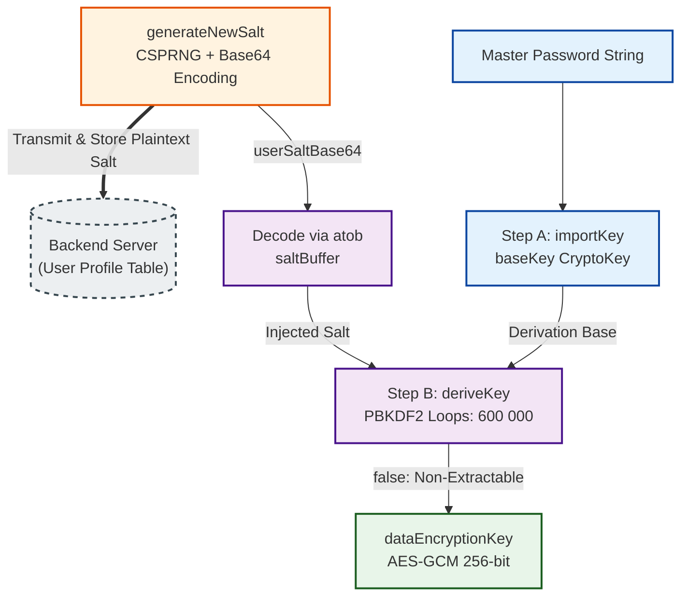
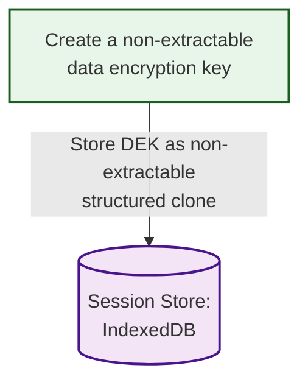
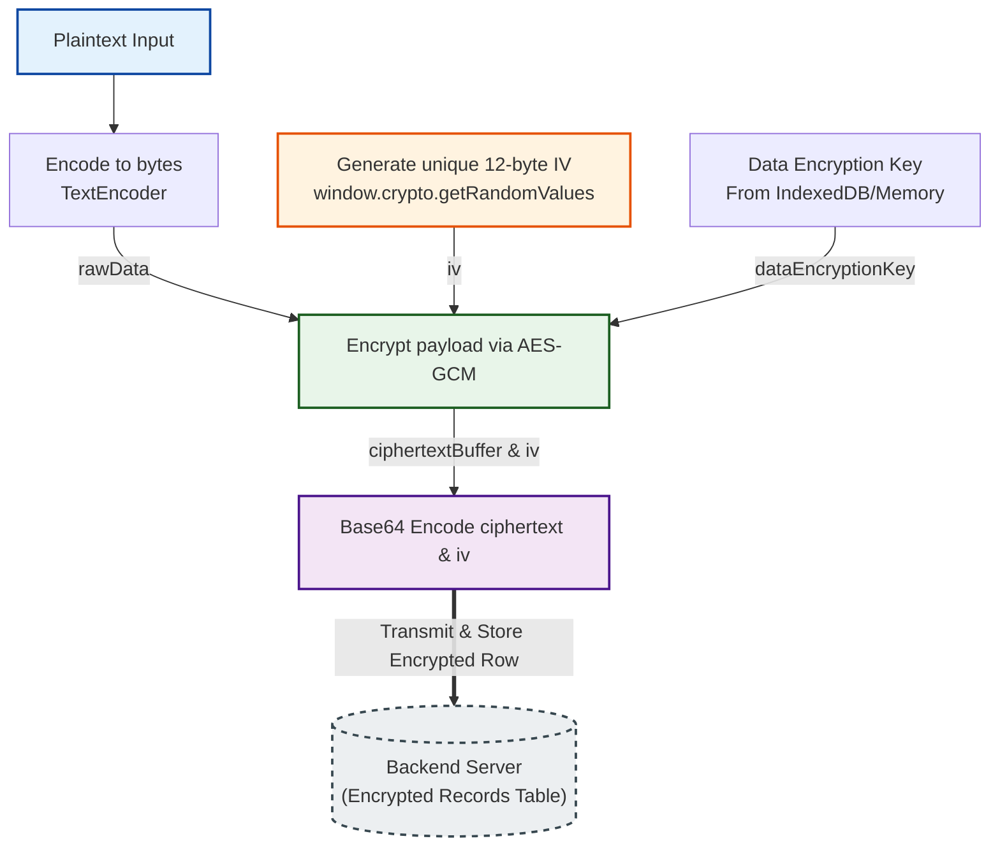
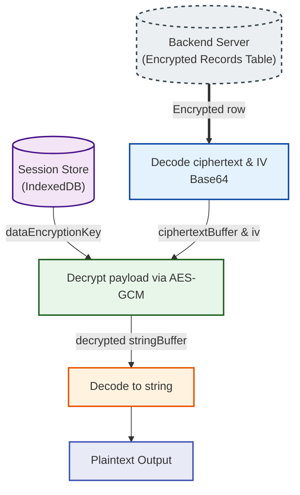
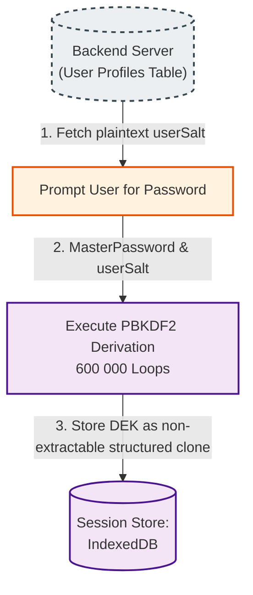
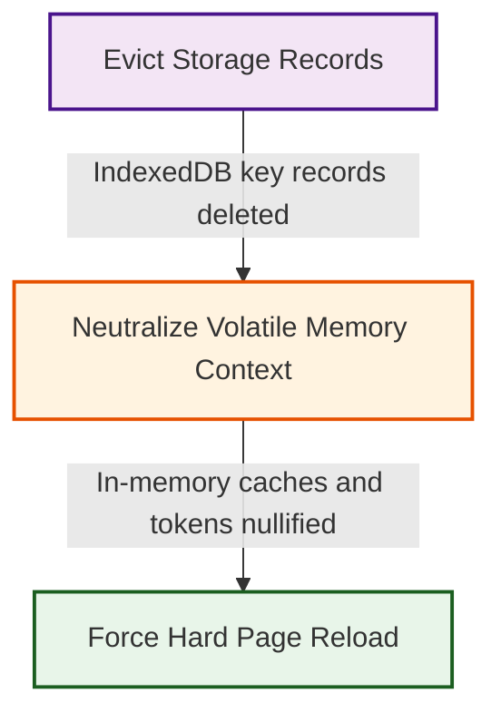

To make a zero-knowledge architecture a reality, we must begin by establishing a secure cryptographic baseline for a single user's isolated vault. The entire security model rests on a fundamental problem: How do we turn a human-readable master password into an unbreakable encryption key inside the browser, use it to secure data, and store it safely without ever leaking it to our server or a rogue script?

This first part of our series focuses on Symmetric Encryption—the foundational building block where data is locked and unlocked using the exact same secret key. We will explore how to use the browser's native Web Crypto API to derive highly secure keys, how to cache them safely using non-extractable storage patterns in IndexedDB, and how to build a destructive client-side lifecycle that guarantees no cryptographic footprints are left behind when a user logs out.

# The Lockbox Analogy

To understand client-side encryption, think of your server as a public storage facility.

In a traditional cloud application, you hand your unencrypted data to the facility manager. They put it in a box, lock it with their master key, and promise to guard it. If a rogue employee or a thief steals the manager's key, your data is exposed.

In a _Zero-Knowledge End-to-End Encrypted Architecture_, you bring your own heavy steel lockbox to the facility. You place your data inside, lock it with your personal key, and hand the box to the manager. The manager can store the box, stack it, or move it, but because they don't have your key, they have absolutely no idea what is inside. This is also called symmetric encryption, meaning the exact same key used to lock the box is the only key that can unlock it. As long as you are the only person who holds that key, your data is perfectly safe.

# The Core Cryptographic Strategy: Key Derivation

In a web-based End-to-End Encrypted (E2EE) data system, everything hinges on the user's Master Password. Because the server must not have access to the unencrypted data, the browser uses this password to derive a Symmetric Data Encryption Key (DEK) locally.

We use Symmetric Encryption, specifically the AES-256 (Advanced Encryption Standard) algorithm, because it is incredibly fast and mathematically optimized for handling large amounts of data, like text files, databases, and user payloads. However, modern symmetric algorithms are incredibly rigid: they require a precisely formatted, 32-byte binary key of pure, uniform randomness. A standard human password like `MySecretPassword123!` fails this requirement entirely.

To bridge this gap, the browser passes the password through a Key Derivation Function (KDF) (such as PBKDF2 or Argon2id) via the native Web Crypto API. This function executes two vital architectural jobs:

- **Key Normalization (Shape):** The KDF acts as a translator, swallowing a variable-length human string and digesting it into a mathematically perfect cryptographic key of the exact bit-length required by AES-256.
- **Key Stretching (Slowness):** Humans are predictably bad at generating randomness (low entropy). To fix this, a KDF uses Key Stretching to artificially inflate the computational cost of guessing a password. By forcing the browser to run the password through a massive number of sequential hashing iterations, 600 000 loops for PBKDF2 guessing a password via brute-force becomes mathematically unfeasible for an attacker, while remaining a fraction of a second for a legitimate user login.

**Note on Custom Hardware:** Modern KDFs like Argon2id take this further by being "memory-hard," forcing the system to use a specific amount of RAM rather than just raw CPU loops. This effectively neutralizes specialized hacker hardware like GPUs or ASICs, leveling the playing field in favor of the user's browser.

## The Role of the `userSalt`

A key derivation function cannot safely run on a password alone. It requires an accompaniment known as a cryptographic salt, a block of completely random data injected into the KDF alongside the password during the derivation process.

Crucially, this salt must be transmitted to and stored on your backend server, typically mapped directly to the user's global account profile, so it can be retrieved whenever the cryptographic key needs to be reconstructed. The salt serves two vital architectural purposes: resolving the multi-device dilemma and blocking mass-attack vectors.

### 1. The Multi-Device Dilemma

In a zero-knowledge system, your server never knows the user's master password or their Data Encryption Key (DEK). This means the client browser must recreate the DEK locally every single time a user logs in, clears their cache, or switches to a new device (like moving from a laptop to a phone).

Because a KDF is a strict mathematical formula, inputting the same password with a different salt will output a completely different, incorrect key. If the salt were only saved locally on the initial device, a second device would have no way of knowing what salt to use, permanently locking the user out of their data.

To allow seamless multi-device access, the server acts as the central repository for the user's salt. When a user logs in from any device, the flow operates at a profile level:

1. The client sends the user's username or email to the server.
2. The server looks up the user's account profile and returns the plaintext userSalt to the client.
3. The client browser takes the master password typed by the user, combines it with the retrieved profile salt, and locally runs the 600 000 KDF loops to recreate the exact DEK needed to decrypt the database records.

### 2. Defeating Mass Attacks

Beyond enabling multi-device access, using a unique salt on the user's profile blocks two devastating mass-attack vectors if your database is ever compromised:

- **The Mirror Effect:** If two entirely different users choose the exact same master password, a KDF without a salt spits out the exact same Data Encryption Key (DEK). If an attacker cracks one, they unlock both. A unique salt ensures identical passwords yield completely unique keys.
- **Bulk Cracking (Rainbow Tables):** Attackers use massive, precomputed databases of popular passwords already run through millions of KDF variations to instantly match un-salted keys. A unique salt forces an attacker to throw away these precomputed tables. Even though they know the salt, they cannot batch their work. They are forced to manually recalculate those 600 000 hashing iterations from scratch individually for every single account in the database.

## The Mathematical Multiplier: Slowness vs. Uniqueness

To see why the combination of key stretching of KDF and a user salt is so lethal, we have to look at how the Salt (which forces uniqueness) multiplies the defensive power of Key Stretching (the 600 000 iterations that force slowness).

Attackers don't just magically know your password; they have to guess it using a "dictionary" of millions of known passwords, combined with common variations (like adding "!" or changing "e" to "3"). Let's say a hacker steals your salted account and wants to run a modest list of 10 million possible passwords against it.

If an attacker steals a database of 10,000 users ($U$) and runs a dictionary of 10,000,000 password guesses ($G$) against it, the active defense mechanics dictate their total mathematical workload:

| Security Configuration  | Workload Formula                         | Total Operations                        | The Real-World Result                                                                                                                                            |
| ----------------------- | ---------------------------------------- | --------------------------------------- | ---------------------------------------------------------------------------------------------------------------------------------------------------------------- |
| No Salt + No Stretching | $G$                                      | 10 000 000                              | **Instant Crack:** Standard hashes take milliseconds on modern GPUs. The entire database falls instantly.                                                        |
| Key Stretching Only     | $G \times \text{600 000 loops}$          | 6 000 000 000 000 (6 trillion)          | The Batch Loophole: It takes 6 trillion operations, but without a salt, that single effort tests the dictionary against all 10,000 users at once.                |
| Salt Only               | $G \times U$                             | 100 000 000 000 (100 billion)           | solated but Fast: The attacker is forced to target users individually, but because un-stretched hashes take microseconds, a GPU burns through it in seconds.     |
| The Lethal Combo (Both) | $G \times \text{600 000 loops} \times U$ | 60 000 000 000 000 000 (60 quadrillion) | Mathematical Exhaustion: The salt isolates every user into their own silo, while stretching forces the attacker to grind 600 000 loops for _every single guess._ |

By combining them, the salt forces the workload to scale linearly with the number of users, while stretching forces it to scale with the iterations. Because the salt is purely a public anchor to force this unique, localized calculation, the server can safely store it in plain text and hand it out freely to the client upon login.

<details>
<summary>Why the salt does not need to be secret</summary>

It is a common assumption that everything in cryptography must remain a secret to be secure. However, a salt's power doesn't come from secrecy; it comes from uniqueness.

If an attacker compromises the server and steals the database, obtaining the plaintext salt does not make it easier to crack an individual password. The 600 000 loops aren't a separate security layer; they are the key derivation process itself. This loop count acts as a heavy mathematical "tax" that an attacker must pay for every single guess they want to try.

Because the salt is public, the attacker simply appends it to their guess, but they still have to pay that exact same mathematical tax:

- **Without a salt:** Guess a password → Run the 600 000-loop KDF → Check the output.
- **With a salt:** Guess a password + the known salt → Run the 600 000-loop KDF → Check the output.

The computational effort per individual guess is identical. Instead, the public salt is there to block a much more devastating threat.

### The Real Threat: The "Buy One, Get 10 000 Free" Attack

Salts aren't there to make a weak individual password magically strong. They are there to stop attackers from cracking everyone else's password at the same time using batch processing.

Imagine a database with 1 000 000 users, and no salts are used:

1. The attacker guesses the most common password in the world: "123456".
2. They run the 600 000-loop KDF just once to see what the resulting key looks like.
3. They compare that single result against all 1 000 000 users instantly.
4. Statistically, they just instantly unlocked about 10 000 accounts with one single unit of work.

### How the Stolen Salt Saves the Day

Now, look at the exact same database with unique, stolen plain-text salts for every user.

Because a unique salt forces a completely different mathematical output, the attacker cannot batch their work. If they want to try the guess "123456", they are forced to run that heavy 600 000-loop KDF calculation completely from scratch, over and over again, individually for every target:

1. For User 1, they must compute: KDF("123456" + Salt_1) (600 000 loops)
2. For User 2, they must compute: KDF("123456" + Salt_2) (600 000 loops)
3. For User 3, they must compute: KDF("123456" + Salt_3) (600 000 loops)

Even though the hacker knows all the salts, they must perform the 600 000-loop calculation 1 000 000 separate times just to test one single password guess across the database. This turns what would be a 1-millisecond batch attack into an incredibly slow, computationally expensive grind.

</details>

## Implementing Key Derivation and Salt Generation

The diagram below maps out this data-vault initialization, directly reflecting our client-side implementation.

Notice how a cryptographically secure random salt is generated and encoded via `btoa` before being transmitted to the server. When deriving the key, the master password string is transformed into an internal baseKey (Step A), while the base64 salt is decoded back to raw bytes via `atob` so both can be processed by the local PBKDF2 derivation engine (Step B) to produce our final, non-extractable `AES-GCM` key.

<div align="center">



</div>

When a user initializes their data vault for the first time, the client browser must generate the unique salt locally using a Cryptographically Secure Pseudorandom Number Generator (CSPRNG) before deriving the key:

```ts
function generateNewSalt() {
  // Generate a secure 32-byte (256-bit) unique salt array
  const saltBytes = window.crypto.getRandomValues(new Uint8Array(32));

  // Convert to Base64 to safely transmit and store as plain text on the server
  return btoa(String.fromCharCode(...saltBytes));
}
```

Next, we can derive a key:

```ts
async function deriveDataEncryptionKey(masterPassword, userSaltBase64) {
  // Convert the incoming public salt from base64 back to binary bytes
  const saltBuffer = Uint8Array.from(atob(userSaltBase64), (c) => c.charCodeAt(0));

  // Step A: Import the raw string into a secure CryptoKey wrapper
  const baseKey = await window.crypto.subtle.importKey(
    'raw',
    new TextEncoder().encode(masterPassword),
    'PBKDF2',
    false,
    ['deriveKey'],
  );

  // Step B: Derive the final Data Encryption Key (DEK)
  const dataEncryptionKey = await window.crypto.subtle.deriveKey(
    {
      name: 'PBKDF2',
      salt: saltBuffer,
      iterations: 600000,
      hash: 'SHA-256',
    },
    baseKey,
    { name: 'AES-GCM', length: 256 },
    false, // Crucial: Make the key non-extractable
    ['encrypt', 'decrypt'],
  );

  return dataEncryptionKey;
}
```

<details>
<summary>Deconstructing the Boilerplate: Why importKey?</summary>
Executing an importKey( ) step just to immediately run a deriveKey( ) function feels like unnecessary code boilerplate. Why can't we just pass the raw password string straight into the KDF engine?

This explicit multi-step pipeline is a deliberate security architecture built into the Web Crypto API, addressing three critical real-world vulnerabilities:

1. **Web Crypto Only Speaks Opaque "CryptoKey" Objects:** The Web Crypto API (`window.crypto.subtle`) is hyper-restrictive by design to protect your application from memory-scraping attacks. It refuses to accept raw JavaScript strings or raw byte arrays for direct cryptographic updates. Before the browser's internal engine will even touch your password, `importKey` must encapsulate those raw bytes into an opaque, strongly typed, internal CryptoKey wrapper (our `baseKey`). This moves the sensitive data out of vulnerable, high-level JavaScript memory and into the browser’s isolated cryptographic sandbox.
2. **The Principle of Least Privilege (Usage Guardrails):** Notice the last argument passed to `importKey: ['deriveKey']`. This assigns a strict cryptographic usage flag to the object. You are explicitly telling the browser's engine: _"This key is only authorized to act as an input for a KDF."_ If a rogue script (via a malicious npm package or XSS) attempts to hijack this `baseKey` to directly encrypt a leaked file or sign a malicious payload, the browser blocks the execution instantly. It cannot be used for anything other than its declared purpose.
3. **The Character-vs-Bit Trap (Why We Need Key Normalization):** A common development pitfall is assuming that typing or padding a password until it hits a specific length fulfills the requirements of a symmetric key. It does not. In JavaScript, strings are UTF-16 encoded, meaning a 256-character string actually consumes 512 bytes (4096 bits) of underlying memory. Conversely, AES-256 expects exactly 256 bits (32 bytes) of dense, high-entropy randomness. Simply appending trailing spaces or repeating characters to a password adds zero security—an attacker's software knows the padding scheme instantly.

`importKey` prepares the raw human string, but it is the subsequent KDF loop (Step B) that takes that low-entropy input and compresses or expands it into the mathematically perfect, uniform 32-byte shape required for encryption.

</details>

# Secure Client-Side Storage via IndexedDB

To prevent the user from having to type their Master Password every single time they perform an action, navigate to a new page, or refresh their tab, the derived key must be persisted client-side during the session.

For large data payloads and key management, IndexedDB is the ideal choice in modern browsers. However, storing a raw cryptographic key in plain text within IndexedDB exposes the system to Cross-Site Scripting (XSS) attacks.

## Mitigation: Non-Extractable CryptoKeys

The Web Crypto API introduces an elegant defense-in-depth feature: non-extractable keys.

When you generate or derive a key via crypto.subtle, you can set the extractable parameter to `false`.

- You can store this raw CryptoKey object directly into IndexedDB as a structured clone.
- You cannot read its raw byte sequence via JavaScript running in the console, nor can a rogue third-party script export the raw key material to an external server.

**Security Note:** While non-extractable keys protect against direct key exfiltration via basic XSS, a malicious script could still instruct the browser to decrypt data locally if it achieves execution access. Therefore, [robust Content Security Policies (CSP)](https://nextjs.org/docs/app/guides/content-security-policy) remain mandatory.

## Implementing Secure Key Storage

Visually, this architecture establishes a strict, one-way security boundary. Once the derived key is written to IndexedDB with its extraction permission set to `false`, it becomes an opaque structured clone—fully usable by the browser's native cryptographic engine, but completely hidden from the JavaScript runtime and external inspection.

<div align="center">



</div>

To implement this, you wrap the non-extractable `CryptoKey` inside a metadata wrapper object before saving it to IndexedDB.

Here is how you could adapt the previous IndexedDB storage module to enforce a sliding timeout:

```ts
const DB_NAME = 'SecureVaultStorage';
const STORE_NAME = 'SessionKeys';
const KEY_LABEL = 'active_dek';

// 15 minutes in milliseconds
const INACTIVITY_TIMEOUT = 15 * 60 * 1000;

async function saveSessionKeyWithTTL(cryptoKey) {
  const db = await openDatabase();

  const sessionWrapper = {
    keyInstance: cryptoKey,
    // Set the initial expiration timestamp
    expiresAt: Date.now() + INACTIVITY_TIMEOUT,
  };

  return new Promise((resolve, reject) => {
    const transaction = db.transaction(STORE_NAME, 'readwrite');
    const store = transaction.objectStore(STORE_NAME);
    const request = store.put(sessionWrapper, KEY_LABEL);

    transaction.oncomplete = () => resolve(true);
    transaction.onerror = (event) => reject(event.target.error);
  });
}

async function loadSessionKeyWithTTL() {
  const db = await openDatabase();

  return new Promise((resolve, reject) => {
    const transaction = db.transaction(STORE_NAME, 'readwrite');
    const store = transaction.objectStore(STORE_NAME);
    const request = store.get(KEY_LABEL);

    request.onsuccess = async () => {
      const data = request.result;

      if (!data) {
        return resolve(null); // No active session
      }

      // Check if the current time has surpassed the expiration wall
      if (Date.now() > data.expiresAt) {
        // HARD EVICTION: Cryptographic material has expired. Wipe it immediately.
        store.delete(KEY_LABEL);
        return resolve(null);
      }

      // SLIDING WINDOW: The session is valid. Update the expiry time for the next check.
      data.expiresAt = Date.now() + INACTIVITY_TIMEOUT;
      store.put(data, KEY_LABEL);

      resolve(data.keyInstance);
    };

    request.onerror = (event) => reject(event.target.error);
  });
}
```

**Note:** the silent killer: Relying Only on loadSessionKey

Enforcing the TTL solely inside the loadSessionKey function introduces an edge case: if a user leaves a tab open and walks away for 3 hours, the key sits completely vulnerable in memory and in IndexedDB until they happen to trigger a read function.

To turn this into a truly bulletproof implementation, you should tie the TTL to application lifecycle events:

- **Memory Sanitization on Visibility Change:** Listen to the browser's visibilitychange or pagehide events. If the user minimizes the browser or switches tabs for longer than your timeout duration, proactively purge the key from memory and IndexedDB.

- **Global Activity Listeners:** Run a lightweight, debounced event listener on the window object for user interactions (mousemove, keydown, click). If no events fire within 15 minutes, trigger a destructive clearSession() function that explicitly wipes the store and redirects to the lock screen.

## The Zero-Knowledge Storage Blueprint

Before we dive into the exact code for reading and writing data, let's look at how this architecture maps to a physical database. Because our server is completely blind, our database tables are intentionally split into two distinct structures: The Profile Table (system metadata) and The Vault Data Table (encrypted payloads).

Here is exactly what your database sees versus what remains strictly local to the user's browser memory.

### 1. The User Profile Table

This table lives on the server and handles authentication and key-derivation metadata. It contains the KDF configuration and the plaintext salt. The server needs to see these to hand them back to the client upon login, but they contain zero sensitive user data.

| Column Name | What the Server Sees                  | Who Can Read / Use It?                            |
| ----------- | ------------------------------------- | ------------------------------------------------- |
| user_id     | user_alice_11                         | Server & Client (Identity Lookup)                 |
| email       | alice@clinic.com                      | Server (Authentication & login)                   |
| kdf_salt    | argon2id_v=19_m=65536,t=3,p=4$sAlT... | Client Only (Downloaded to derive the Master Key) |

**Local Memory Note (RAM Only):** Notice what is missing from the server profile table. The user's raw master password and the derived Symmetric Master DEK are never sent to the server. They exist exclusively inside the browser's volatile RAM and as a non-extractable clone inside the client's local IndexedDB.

### 2. The Vault Data Table

This table stores the actual data payloads. Because we are using authenticated symmetric encryption (AES-GCM), every single record row must store its own unique Symmetric IV alongside the ciphertext. Without that specific IV, the client cannot decrypt the block, but to the server, the entire row looks like unreadable text strings.

| Record ID | Owner User ID                | Symmetric IV (Plaintext) | Encrypted Content (Ciphertext + Auth Tag) |
| --------- | ---------------------------- | ------------------------ | ----------------------------------------- |
| note_101  | user_alice_11d3f2a91b29a1... | aesgcm:3f82a...          | 92f1 (Opaque Blob)                        |
| note_102  | user_alice_118c11e0b244c1... | aesgcm:9c21b...          | 01ab (Opaque Blob)                        |

**The Security Boundary:** If an adversary completely compromises the database backend, all they get is a list of public user IDs, salts, initialization vectors, and encrypted nonsense. Without the master password to execute the client-side KDF loops, the data remains an unbreakable wall.

# Write and Read Flows (Encryption & Decryption)

Once the data encryption key is established and safely held in memory or IndexedDB, the data pipeline follows a strict encrypt-before-send and decrypt-after-read pattern.

## The Encryption Pipeline (Writing Data)

Think of the encryption pipeline as a strict cryptographic assembly line. It ingests your plaintext string, encodes it into raw bytes, generates a completely unique 12-byte Initialization Vector (IV) to guarantee semantic security, and processes them through the AES-GCM engine before bundling them into a Base64 package safe for database storage.

<div align="center">



</div>

When saving records, you must avoid using the same key parameters repeatedly. We achieve semantic security using AES-GCM 256-bit encryption combined with a unique Initialization Vector (IV). The IV ensures that if a user encrypts the exact same text twice, it produces completely different ciphertext outputs, preventing patterns from leaking to the server.

```ts
async function encryptPayload(plaintext, dataEncryptionKey) {
  const encoder = new TextEncoder();
  const rawData = encoder.encode(plaintext);

  // Generate a unique 12-byte cryptographically secure IV for each record
  const iv = window.crypto.getRandomValues(new Uint8Array(12));

  // Encrypt the data using AES-GCM
  const ciphertextBuffer = await window.crypto.subtle.encrypt(
    {
      name: 'AES-GCM',
      iv: iv,
    },
    dataEncryptionKey,
    rawData,
  );

  // Package the results. Arrays must be formatted (e.g., Base64 or Hex) before JSON transmission
  return {
    ciphertext: btoa(String.fromCharCode(...new Uint8Array(ciphertextBuffer))),
    iv: btoa(String.fromCharCode(...iv)),
  };
}
```

The resulting base64 strings representing the ciphertext payload and the IV are bundled together and safely transmitted to the backend server.

<details>
<summary>Salt vs. IV</summary>
It is important not to confuse the User Salt with the Initialization Vector (IV):

- **The User Salt** is generated once during registration, stored with the user's profile metadata on the server, and used strictly to derive the main encryption key.
- **The IV** is generated dynamically every single time you encrypt an individual record. It is sent to the server and stored directly alongside that specific ciphertext payload, because the browser requires both the ciphertext and its unique IV to successfully decrypt the record later.

**The Golden Rule of AES-GCM:** While the IV doesn't need to be secret, it **must** be globally unique for every single encryption operation using that key. Reusing the same IV with the same Data Encryption Key (DEK) in AES-GCM breaks the mathematical security boundaries entirely, allowing an attacker to reconstruct the plaintext data without ever knowing the key.

  </details>

## The Decryption Pipeline (Reading Data)

The decryption engine mirrors the write pipeline in reverse, executing entirely within the localized sandbox of the client window. It decodes the Base64 payloads streaming from your database and feeds them alongside your cached session key directly into the Web Crypto decryption engine to reconstruct the raw data.

<div align="center">



</div>

When pulling data down from the database, the reverse process must take place entirely within the local context of the browser window.

```ts
async function decryptPayload(base64Ciphertext, base64Iv, dataEncryptionKey) {
  // Convert base64 payloads back into binary arrays
  const ciphertext = Uint8Array.from(atob(base64Ciphertext), (c) => c.charCodeAt(0));
  const iv = Uint8Array.from(atob(base64Iv), (c) => c.charCodeAt(0));

  // Decrypt using the locally stored CryptoKey object
  const decryptedBuffer = await window.crypto.subtle.decrypt(
    {
      name: 'AES-GCM',
      iv: iv,
    },
    dataEncryptionKey,
    ciphertext,
  );

  // Convert the decrypted raw bytes back into a human-readable string
  const decoder = new TextDecoder();
  return decoder.decode(decryptedBuffer);
}
```

The decrypted plaintext string is temporarily mapped directly to the application state or UI and is never committed to unencrypted persistent storage or cached disk logs.

# The Clean Slate Lifecycle: Handling New Devices and Cache Clears

This sequence maps out the strict waterfall dependencies required during a cold boot or a first-time device sync. Because the client browser lacks a persisted key in local storage, it must execute an initialization sequence to reconstruct the environment from scratch.

The initial network request acts as a hard functional prerequisite, fetching the public metadata needed to unlock the client-side cryptographic engine.

<div align="center">



</div>

Once the `dataEncryptionKey` is securely cached inside IndexedDB, the heavy lifting of the initialization phase is officially over. The client browser has successfully restored its secure baseline.

From this exact point forward, the temporary cold-boot state resolves into a standard, active session. The application can now freely run the standard encryption and decryption flows described previously: pulling encrypted record chunks down from the server database, unwrapping them locally via AES-GCM, and feeding the plaintext into the UI without ever needing to prompt the user for their master password again.

# The Destructive Logout: Purging the Cryptographic Footprint

In a standard web application, logging out is a simple network event. The client sends a request to the server, the server invalidates a session cookie or JSON Web Token (JWT), and the user is redirected to a login page.

In a Zero-Knowledge E2EE architecture, this standard routine is dangerously insufficient. Even if the server revokes your network session, the Data Encryption Key (DEK) and your decrypted data payloads still reside inside the browser’s volatile JavaScript memory and persistent IndexedDB storage. If a user clicks "Logout" at a public terminal and walks away, an attacker could simply open the browser's developer console, extract the data from IndexedDB, and read the entire vault.

Therefore, an E2EE logout must be treated as a client-side memory sanitation event. A robust logout pipeline must execute three distinct phases:

1. **Storage Eviction:** The application must explicitly open IndexedDB, enter the SessionKeys object store, and permanently delete the active_dek record.
2. **Volatile Memory Sanitization:** Any global JavaScript variables, state management stores (like Redux, Pinia, or React Context), or in-memory caches holding the active CryptoKey or plaintext data must be explicitly overwritten and set to null.
3. **The Environment Flush (The Heap Cleanse):** Simply setting a JavaScript variable to null does not instantly remove it from the computer's physical RAM. The browser's engine leaves old data in the memory "heap" until a garbage collection cycle runs, meaning a highly sophisticated local attack could still scrape the key out of RAM. To mitigate this, the final step of an E2EE logout must force a hard browser environment reset using window.location.href = '/login'.

By forcing a full page reload, the browser completely destroys the existing execution context, flushes the entire V8 javascript heap memory, and guarantees that no cryptographic remnants are left behind.

## Implementing a logout pipeline

To enforce a flawless zero-knowledge exit, our logout routine behaves like a coordinated client-side demolition team. As shown below, it systematically purges persistent storage records, neutralizes volatile window references, and executes a hard browser context refresh to completely clear the underlying physical RAM heap.

<div align="center">



</div>

To put these three phases into practice, we can implement an explicit, top-level logout function. By structuring this routine sequentially, we ensure that even if an unexpected error occurs while interacting with IndexedDB, the code will always proceed to the ultimate fail-safe: explicitly clearing volatile app context and forcing a complete browser heap flush.

```ts
async function executeSecureLogout() {
  console.log('Initiating secure client-side memory sanitization...');

  // PHASE 1: Storage Eviction (IndexedDB Purge)
  try {
    const db = await openDatabase(); // Refers to the DB instance handler

    await new Promise((resolve, reject) => {
      const transaction = db.transaction(STORE_NAME, 'readwrite');
      const store = transaction.objectStore(STORE_NAME);

      // Permanently delete the non-extractable CryptoKey from the disk
      const request = store.delete(KEY_LABEL);

      transaction.oncomplete = () => resolve(true);
      transaction.onerror = (event) => reject(event.target.error);
    });

    console.log('IndexedDB cryptographic keys successfully evicted.');
  } catch (error) {
    // Fail-safe: Even if IndexedDB fails or is locked, we MUST proceed
    // to clear volatile memory and flush the heap.
    console.error('IndexedDB purge failed, proceeding with memory flush:', error);
  }

  // PHASE 2: Volatile Memory Sanitization
  // Explicitly overwrite any global application state holding plaintext or keys.
  if (window.AppContext) {
    window.AppContext.dataEncryptionKey = null;
    window.AppContext.decryptedCache = null;
    window.AppContext.userProfile = null;
  }

  // Clear session-bound browser fallback states just in case
  try {
    window.sessionStorage.clear();
    window.localStorage.removeItem('user_session_metadata');
  } catch (e) {
    // Guard against restrictive iframe or browser environment errors
  }

  console.log('Volatile JavaScript context neutralized. Requesting heap flush...');

  // PHASE 3: The Environment Flush (The Heap Cleanse)
  // Simply routing using a single-page app router (like React Router or Vue Router)
  // leaves data vulnerable to RAM-scraping. A hard page reload is required.
  window.location.href = '/login?logout=success';
}
```

<br/>

# Looking Ahead: The Sharing Problem

Our current architecture relies entirely on Symmetric Encryption, meaning the exact same key that locks the data is also used to unlock it. Returning to our analogy, you have a physical lockbox, and you hold the only key in existence.

This works flawlessly as long as you are the only person who ever needs to read your data. But what happens when you want to share access to a specific piece of data with another user?

You cannot give them your master password, and you cannot send your Data Encryption Key over the network to them—doing so would violate our zero-knowledge foundation. If you want to send a secret document to a peer, you can't rely on a shared physical key.

Instead, we need a system where anyone can safely drop a locked message into your box, but only you possess the key to open it.

# Conclusion

Building an end-to-end encrypted web application fundamentally changes how you design your data architecture. By treating the server as an untrusted coordinator and moving both key derivation and cryptographic processes directly into the browser via the Web Crypto API and IndexedDB, you eliminate entire categories of server-side data leaks.

While managing the key derivation cycles, `userSalt` synchronization, and handling multi-device edge cases requires precision, the reward is a data store resilient against data breaches by mathematical design.

In our next article, we will tackle the next structural milestone: extending this single-user architecture into a multi-user collaborative environment using Asymmetric (Public/Private) Cryptography.

# Sources

- [How to build End-to-End Encryption for web apps](https://technori.com/2026/03/24635-how-to-build-end-to-end-encryption-for-web-apps/editorial-team/)
- [End-to-End Encryption](https://www.ibm.com/think/topics/end-to-end-encryption)
- [Password storage cheat sheet](https://cheatsheetseries.owasp.org/cheatsheets/Password_Storage_Cheat_Sheet.html)
