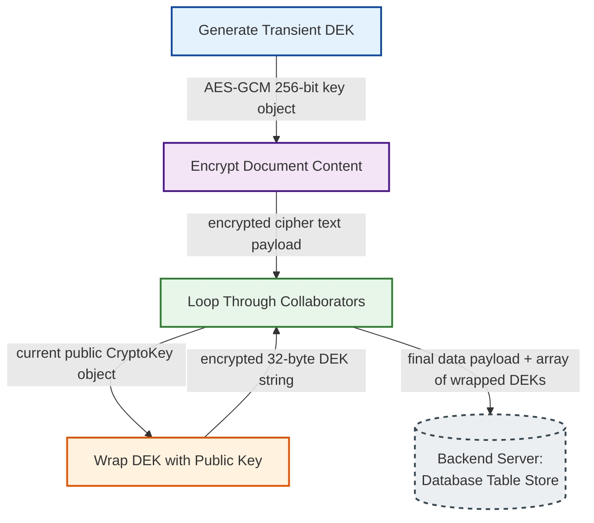
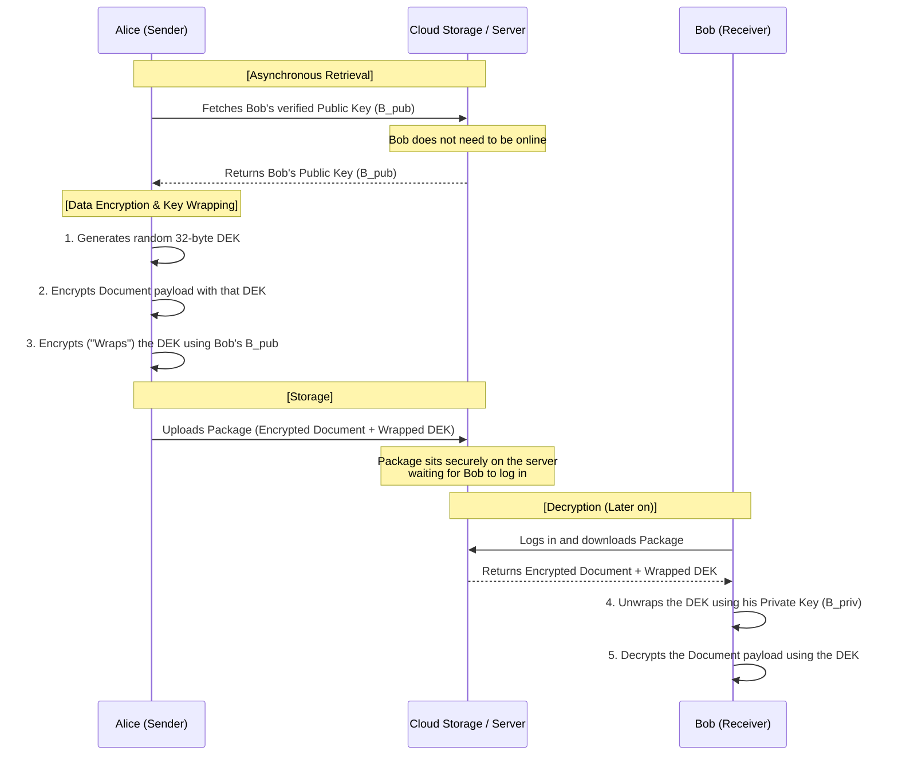
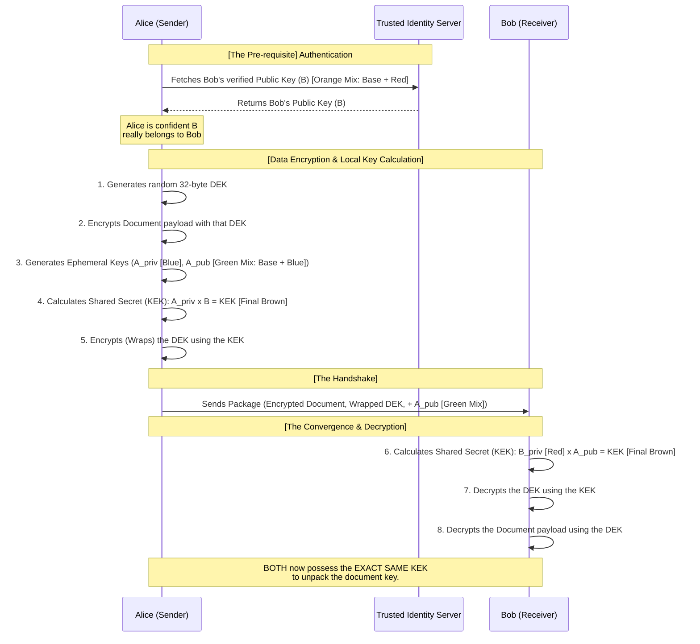
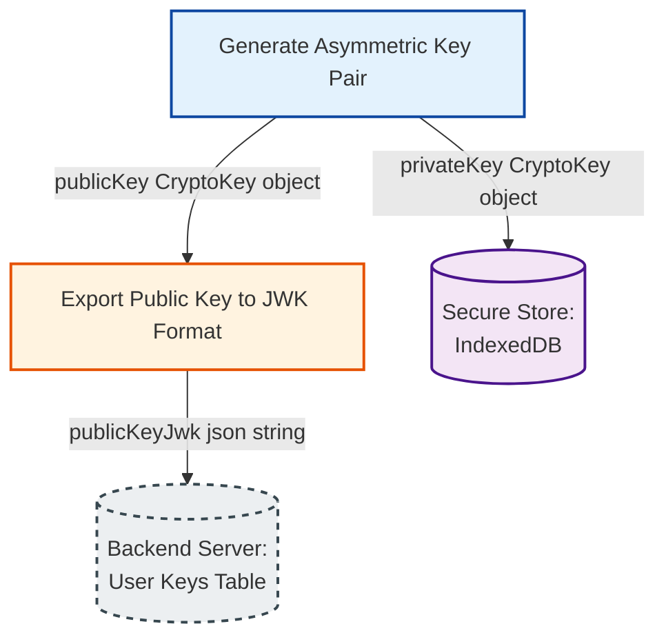

In Part 1 of this series, we built a secure, single-user data vault. We used Symmetric Encryption (`AES-GCM`) to lock and unlock data using a single Data Encryption Key (DEK) derived directly from a user's master password.

This works flawlessly as long as you are the only person who ever needs to access your data. But symmetric encryption hits a hard wall the moment you introduce collaborative features. If you want to share a secret note with a coworker, you cannot send them your master password, nor can you safely use your personal key to encrypt the shared file without giving them access to your entire database.

To break through this limitation without compromising our zero-knowledge foundation, we must transition from a single-key system to a multi-key architecture by leveraging Asymmetric Cryptography and Key Separation.

# The Mailbox Analogy

To understand asymmetric cryptography, we have to swap our heavy steel lockbox for a public mailbox anchored to a brick wall.

Imagine your mailbox has a secure mail slot on the front and a locked door on the back.

- **The Public Key (The Mail Slot):** Anyone in the world can walk up to your mailbox, slip a private letter through the slot, and drop it inside. Once the letter falls to the bottom, nobody standing outside, not even the person who wrote it, can reach back through the slot to pull it out.
- **The Private Key (The Back Door Key):** You hold the only physical key that fits the locked door at the back of the mailbox. Only you can open it to read the messages that have been dropped inside.

In a digital E2EE network, every user generates one of these mailbox pairs. You openly distribute your Public Key to the world (and save it on the server) so anyone can encrypt data for you. But you keep your Private Key strictly to yourself, as it is the only instrument capable of decrypting those payloads.

# The Core Cryptographic Strategy: Hybrid Encryption

In a zero-knowledge collaborative system, asymmetric cryptography solves the trust dilemma, but it introduces a major technical hurdle: performance.

Asymmetric algorithms are mathematically heavy, relying on massive prime number factorization or elliptic curve geometry. Because of this complexity, they are computationally slow and completely incapable of directly encrypting large files or dense database records.

To build a scalable architecture, we combine the best of both worlds using a strategy called _Hybrid Encryption_, governed by a strict design pattern known as _Key Separation_. Instead of forcing a single key to do multiple jobs, we assign distinct keys to distinct tasks based on their mathematical strengths.

- **Symmetric Encryption (The Heavy Lifter):** We continue to encrypt the actual data payloads (text, files, tables) using ultra-fast, lightweight AES-GCM 256-bit keys. Every time you create or edit a collaborative document, a brand-new, unique transient Data Encryption Key (DEK) is generated on the fly.
- **Asymmetric Encryption (The Key Transporter):** Instead of using your asymmetric Public Key to encrypt the data, you use it strictly to encrypt the small 32-byte transient AES key. This process is known as Key Wrapping.

**The Multi-User Mental Shift:** In a single-user vault, you rely on one permanent symmetric master key tied to your profile. In a collaborative multi-user architecture, there is no such thing as a permanent, personal DEK stored on your user profile.

Your profile table only exposes your static Public Key to the world. Instead, every single document or database row generates its own independent, unique DEK on the fly. The server stores these unique DEKs directly inside the document rows, wrapped individually for every user who is granted access.

<details>
<summary>Visual Example: Hybrid Encryption Flow</summary>
By deploying hybrid encryption, sharing a secure document with ten coworkers doesn't require encrypting a heavy file ten separate times. Instead, you encrypt the file once symmetrically, wrap or agree upon the tiny 32-byte DEK ten individual times using each coworker's unique public key architecture, and send the single encrypted payload along with the ten wrapped keys to the server.

The diagram below illustrates this sequential hybrid encryption and distribution workflow:



To visualize how this looks once transmitted, the single heavy document payload remains constant across a row, while individual access rights are provisioned via an array of light, wrapped keys linked to specific user IDs:

| Document ID | Encrypted Content (Symmetric Payload) | Recipient User ID | Wrapped DEK (Asymmetric Key Packet)          |
| ----------- | ------------------------------------- | ----------------- | -------------------------------------------- |
| doc_9081    | aesgcm:7b2a9f3c...0e4b                | user_alice_11     | rsa-oaep:8a2b5f...c7e2 (Alice's self-wrap)   |
| doc_9081    | aesgcm:7b2a9f3c...0e4b                | user_bob_22       | rsa-oaep:1e9d4c...b3a9 (Bob's access packet) |
| ...         | ...                                   | ...               | ...                                          |

**Architecture Note:** Notice that the server database structure avoids duplication of the heavy Encrypted Content field. Adding a new collaborator to a massive 50MB file requires inserting a row containing a mere 256-byte text string (the new recipient's Wrapped DEK), keeping your data storage overhead exceptionally lean.

</details>

<details>
<summary>Single-User vs. Multi-User Architectural Shift</summary>
When moving from a single-user system to a collaborative multi-user network, our database layout must evolve. While Part 1 already cleanly decoupled the Identity Layer (the users table) from the Data Layer (the notes/vault tables) for relational storage, the way keys flow between these tables has to change completely.

In a single-user setup, your data rows are tied cryptographically directly to your profile's password. In a multi-user system, doing this creates a cryptographic breaking point. To share a single file securely, you would either have to expose your entire personal database key to your collaborator, or endure the massive performance penalty of re-encrypting heavy files from scratch for every new user's credentials.

To solve this, we must transition from direct encryption using a user-derived master key to a hybrid multi-key model. The tables stay decoupled, but your user profile transitions into an asymmetric "mailbox registry" while your data tables become self-contained resource hubs.

Let's look at a direct side-by-side comparison of how data access, cryptographic responsibilities, and table attributes radically change when moving from your single-user vault in [Part 1](./pt1-secure-single-user-storage) to this collaborative multi-user architecture in Part 2.

## 1. Single-User Data Vault

As discussed in [Part 1](./pt1-secure-single-user-storage), a single-user system relies entirely on a Symmetric Master Key derived directly from your password. Because nobody else ever needs to open your data, that single master key serves as your profile's master data controller. If you create a note or a record, it is encrypted directly with a key derived from your credentials. It is simple, linear, and completely locked to you.

### User Profile Schema

The password salt and Argon2id configuration string live on the server profile row. When logging in, the client downloads this bundle, applies the parameters to the user's password, and spins up the Master Key straight into volatile memory (RAM).

| Column Name | What the Server Sees                     | Who Can Read / Use It?                            |
| ----------- | ---------------------------------------- | ------------------------------------------------- |
| user_id     | user_alice_11                            | Server & Client (Identity Lookup)                 |
| email       | alice@clinic.com                         | Server (Authentication & login)                   |
| kdf_salt    | `$argon2id$v=19$m=65536,t=3,p=4$sAlT...` | Client Only (Downloaded to derive the Master Key) |

The derived Master Key is never sent to the server. During an active session, the client app either fetches this key from its non-extractable store in IndexedDB or prompts the user for their password to recreate it.

### Data layout

Every individual record requires its own random, unique Symmetric IV (Initialization Vector). The encrypted content column stores the combined Ciphertext + Auth Tag generated by the authenticated AES-GCM algorithm.

| Record ID | Owner User ID                | Symmetric IV (Plaintext) | Encrypted Content (Ciphertext + Auth Tag) | Key Structure                            |
| --------- | ---------------------------- | ------------------------ | ----------------------------------------- | ---------------------------------------- |
| note_101  | user_alice_11d3f2a91b29a1... | aesgcm:3f82a...          | 92f1 (Opaque Blob)                        | Encrypted directly by Alice's Master Key |
| note_102  | user_alice_118c11e0b244c1... | aesgcm:9c21b...          | 01ab (Opaque Blob)                        | Encrypted directly by Alice's Master Key |

**The Cryptographic Breaking Point:** If Alice wants to share `note_101` with Bob using this exact setup, she hits an architectural wall. To give him access, she would either have to expose her personal database key to him (compromising her entire vault) or endure the massive performance penalty of decrypting and re-encrypting heavy payloads from scratch using Bob's credentials.

## 2. Multi-User Collaborative Architecture

In a collaborative system, we break that hard link between your password and the data. We strip the data encryption keys (DEKs) out of the user profile entirely. Instead, the profile holds an Asymmetric Mailbox (your Public/Private key pair). The data payloads are encrypted with their own independent, standalone keys (Group AES Keys), which live right inside the document rows—wrapped separately for each user who has permission to view them.

### User Profile Schema

Your users table now acts purely as an identity escrow. The Argon2id configurations are used strictly to derive the local Master Key, which opens the local "Safe" containing the asymmetric identity.

| User ID       | KDF Parameters & Salt (Plaintext) | public_key (Plaintext RSA)      | encrypted_private_key (Opaque Ciphertext) |
| ------------- | --------------------------------- | ------------------------------- | ----------------------------------------- |
| user_alice_11 | `$argon2id$v=19$m=65536...`       | `-----BEGIN PUBLIC KEY-----...` | uNfX82mPqK... (Locked via Master Key)     |
| user_bob_22   | `$argon2id$v=19$m=65536...`       | `-----BEGIN PUBLIC KEY-----...` | z7pQ29mRk... (Locked via Master Key)      |

### Data Layout

The heavy document payload is stored exactly once alongside its unique Symmetric IV and Auth Tag. Access control is handled completely independently via the asymmetric key packets appended to each row.

| Document ID | Symmetric IV (Plaintext) | Encrypted Content (Ciphertext + Auth Tag) | Recipient User ID | Wrapped DEK (Asymmetric Ciphertext Packet) |
| ----------- | ------------------------ | ----------------------------------------- | ----------------- | ------------------------------------------ |
| doc_9081    | f293a1e09923...          | aesgcm:7b2a9f3c...0e4b                    | user_alice_11     | rsa-oaep:8a2b5f... (Alice's Packet)        |
| doc_9081    | f293a1e09923...          | aesgcm:7b2a9f3c...0e4b                    | user_bob_22       | rsa-oaep:1e9d4c... (Bob's Packet)          |

**The Sharing Solution:** If Alice wants to add Bob to the document, her client doesn't re-encrypt the file or generate a new IV. She simply downloads Bob's public_key from his profile row, encrypts the document's existing 32-byte DEK with it, and inserts a new row into the document table. Bob can now unwrap his packet using his own private key, read the shared payload using the single document IV, and gain instant access entirely offline from Alice.

</details>

When executing hybrid encryption, developers generally choose between two distinct cryptographic patterns to handle that 32-byte key: **Key Transport** or **Key Agreement**.

# Pattern A: Key Transport (The RSA Approach)

The Key Transport pattern is a unidirectional "push" mechanism. It directly mirrors our mailbox analogy and is typically implemented using algorithms like _RSA-OAEP_.

In this model, if Alice wants to share a secure document with Bob, the workflow functions like a digital courier:

- **Asynchronous Retrieval:** Alice fetches Bob’s pre-published Public Key from the server. Bob does not need to be online for this to happen.
- **Key Wrapping:** Alice encrypts the document's unique 32-byte DEK using Bob’s Public Key. This process is called "wrapping."
- **Storage:** Alice sends the symmetrically encrypted document payload along with Bob's wrapped key to the server.
- **Decryption:** When Bob logs in later, he downloads the wrapped key and uses his strictly private Private Key to unwrap it, revealing the 32-byte DEK required to decrypt the file.



## Why use it

Key Transport is exceptionally well-suited for asynchronous database collaboration or email (like PGP). Alice can instantly provision access for ten different coworkers entirely on her own, simply by wrapping the tiny DEK ten individual times using each coworker's unique public key.

# Pattern B: Key Agreement (The ECDH Approach)

The Key Agreement pattern abandons the traditional "mailbox" model of locking a secret directly with a recipient's public key. Instead, it uses a protocol known as ECDH (Elliptic Curve Diffie-Hellman).

Rather than Alice statically locking a secret for Bob, Alice and Bob’s cryptographic keys combine to mathematically derive the exact same shared secret simultaneously.

## The Paint-Mixing Analogy

Think of it like mixing paint: Alice and Bob start with a shared public base color (Yellow). This base isn't unique to either of them—it is a global, standardized starting point that everyone on the network knows. They each mix in their own secret color locally and swap the resulting mixtures. By then adding their own secret color to the other person's mixture, they both arrive at the exact same final shade (Brown)—all without ever exposing their pure secret colors over the network.

<p align="center">
  
</p>

An eavesdropper (Eve) only sees the public starting Yellow base and the intermediate mixed colors. Because it is physically impossible to perfectly un-mix paint, Eve cannot reverse-engineer the packets to figure out the private colors, leaving her completely unable to recreate the final Brown shade.

## The Technical Workflow

Here is how that color-mixing math maps to the actual system workflow:

- **The Pre-requisite (The Public Base & Bob's Mix):** In cryptography, the global public base (Yellow) is called the _Generator Point_. Bob takes this base and mixes in his private key (Red), creating his public key (an Orange mixture). Alice fetches this verified Orange public key from a secure identity server. Because it is pre-verified, an active attacker cannot swap it out with a malicious key.
- **Data Encryption & Local Key Calculation (Alice's Mix):** Before anything is sent, Alice's device does the heavy lifting locally:
  1. She generates a random, 32-byte Data Encryption Key (DEK) and uses it to encrypt the actual document payload.
  2. She takes that same global public base (Yellow) and mixes in her own private key (Blue) to create her temporary public key (a Green mixture).
  3. She applies her private key (Blue) to Bob’s public key (Orange). By combining them, she calculates the shared secret—the Key Encryption Key (KEK), which represents our final Brown shade.
  4. She encrypts ("wraps") her random document DEK using that fresh Brown KEK.
- **The Handshake (The Swap):** Alice bundles the encrypted document, the wrapped DEK, and her temporary public key (the Green mixture) into a package and transmits it over the network to Bob.
- **The Convergence & Decryption (The Final Mix):** When Bob receives the package, his device completes the puzzle:
  1. Bob applies his private key (Red) to Alice’s temporary public key (the Green mixture). Because the order of operations doesn't matter in elliptic curve geometry, adding Red to Green yields the exact same final coordinate—deriving the identical Brown KEK.
  2. Bob uses this KEK to decrypt the wrapped DEK.
  3. Bob uses the decrypted DEK to unpack and read the document payload.



## Managing the Lifecycle of the DEK

To understand how this protects data over time, it helps to look at the relationship between the document key and the handshake key:

- **The Document Key:** Alice randomly generates a standard Data Encryption Key (DEK) to encrypt the actual document payload.
- **The Key Envelope:** Alice uses the newly calculated KEK (the ECDH shared secret) to encrypt ("wrap") that 32-byte DEK.
- **The Transfer:** The temporary ECDH keys exist solely to securely transport this DEK across the network.

Once Bob’s device calculates the shared secret and uses it to decrypt the incoming DEK, his client browser saves that decrypted DEK directly into his local, non-extractable IndexedDB cache. The temporary session keys and the KEK are then permanently destroyed.

## How to Decrypt the Data Later On

Because the handshake keys are short-lived, the decryption process looks different depending on when Bob opens the document:

- **Decrypting Today (First Time):** Bob's device performs the ECDH calculation using Alice's temporary public key and his own private key. He derives the KEK (our final Brown paint mixture), decrypts the incoming DEK, stores that DEK in his local cache, and uses it to decrypt the document.
- **Decrypting Tomorrow (Historical View):** When Bob returns to read the historical document tomorrow, he bypasses the network handshake entirely. He does not need to recalculate the ECDH math or look for Alice's temporary public key. Instead, his browser fetches the document's specific DEK directly from his local IndexedDB cache and decrypts the file instantly.

## Why use it

Key Agreement is highly efficient and offers a critical security property known as Forward Secrecy. Because Alice uses a uniquely generated temporary key pair for this specific transaction, an attacker who compromises Bob's long-term private key next year still cannot retroactively decrypt past network traffic. This makes ECDH the gold standard for secure cloud storage, real-time collaboration tools, and modern sync protocols.

# The Security Trade-Off: Forward Secrecy vs. Offline Availability

Looking at these two patterns, a vital question emerges: Is one pattern fundamentally safer than the other? Mathematically, Key Agreement (ECDH) provides a significantly stronger long-term security posture than Key Transport (RSA) because it limits the "blast radius" of a future data breach.

## The Vulnerability of Key Transport

Key Transport relies on a static, long-term master key pair. If an adversary intercepts and archives your encrypted network traffic today, they cannot read it. However, if that attacker manages to physically compromise Bob’s device two years from now and steals his long-term RSA Private Key, they can retroactively unwrap every single historical data key they ever collected. A breach today exposes all past history.

## The Power of Perfect Forward Secrecy (PFS)

Key Agreement inherently solves this via Perfect Forward Secrecy. When implementing ECDH, devices typically generate short-lived, throwaway ("ephemeral") curve keys purely for that session. Once the shared secret is calculated, the ephemeral keys are permanently deleted from memory. If Bob's master device is compromised next year, the attacker gains nothing historically, because the cryptographic components used to build past secrets no longer exist anywhere on earth.

## The Developer's Dilemma: Asynchronous Collaboration

If ECDH with Forward Secrecy is the gold standard for security, why do systems still use RSA Key Transport? It boils down to user availability.

- **RSA** allows Alice to share a document with Bob entirely asynchronously while Bob is offline. She just grabs his static public mailbox token, wraps the key, and uploads it.
- **ECDH** traditionally requires a live, interactive cryptographic handshake between both machines to establish those unique, temporary session keys. If Bob is offline for a week, Alice can't easily perform a live handshake with his device.

## The Modern Compromise: Stored Pre-Keys

To bridge this gap and get the best of both worlds, modern zero-knowledge architectures (pioneered by the Signal Messaging Protocol) use a hybrid variant of ECDH known as Stored Pre-Keys.

Instead of forcing a live handshake, Bob's device pre-generates a bundle of temporary public curve keys and uploads them to the server ahead of time. When Alice wants to securely share a document while Bob is offline, her app "consumes" one of Bob’s pre-saved, one-time public keys from the server to calculate an ECDH shared secret immediately.

When Bob logs back in days later, he downloads Alice's public key alongside the specific pre-key ID she used, performs the matching math, and immediately deletes the corresponding private pre-key from his device.

Ultimately, choosing between RSA and ECDH is not just a math choice—it is an architectural design decision. For simple, offline-first document databases, Key Transport offers seamless usability out of the box. For high-security environments, real-time sync engines, or apps requiring strict compliance, implementing an asynchronous ECDH pre-key architecture is well worth the engineering complexity to guarantee absolute Forward Secrecy.

# Implementing Asymmetric Key Architectures

Now that we have analyzed the conceptual blueprints of both patterns, let's explore how to implement them.

## 1. Implementing Key Transport (The RSA Approach)

To implement Key Transport, a user's browser must generate a permanent asymmetric key pair. We use the RSA-OAEP algorithm, specifying a secure `2048-bit` modulus length and a standard public exponent (65537).

### Key Generation & Distribution

When a user initializes collaboration, the browser splits the key management into two distinct tracks: the public key is safely exported as a plain-text JSON string for the server, while the high-entropy private key remains strictly non-extractable and locked inside local client-side storage.

<div align="center">



</div>

```ts
async function generateAndRegisterAsymmetricKeys() {
  // Step 1: Generate a high-entropy RSA-OAEP cryptographic key pair
  const keyPair = await window.crypto.subtle.generateKey(
    {
      name: 'RSA-OAEP',
      modulusLength: 2048,
      publicExponent: new Uint8Array([1, 0, 1]), // Equivalent to 65537
      hash: 'SHA-256',
    },
    false, // Crucial: Keep the private key non-extractable
    ['wrapKey', 'unwrapKey'], // Authorized strictly for securing symmetric DEKs
  );

  // Step 2: Export the Public Key to a shareable JSON Web Key (JWK) format
  const publicKeyJwk = await window.crypto.subtle.exportKey('jwk', keyPair.publicKey);

  // Step 3: Save the non-extractable private key to local storage
  await savePrivateKeyToLocalStore(keyPair.privateKey);

  // Return the public JWK string to be transmitted to the backend server
  return JSON.stringify(publicKeyJwk);
}
```

### Read & Write Flow (Encrypting & Decrypting)

Once the keys are registered, the architecture orchestrates how data keys are provisioned depending on who needs to access the resource.

#### Scenario 1: Access for the Creator (The Self-Encryption Flow)

When Alice creates a document, she generates a random 256-bit symmetric Data Encryption Key (DEK). She encrypts the file with the DEK, and then uses her own public key to wrap that DEK. This ensures that she can always unwrap it later with her private key.

```ts
async function encryptAndWrapForSelf(documentData: string, alicePublicKey: CryptoKey) {
  // 1. Generate a transient, random symmetric key (DEK)
  const dek = await window.crypto.subtle.generateKey({ name: 'AES-GCM', length: 256 }, true, [
    'encrypt',
    'decrypt',
  ]);

  // 2. Symmetrically encrypt the document content
  const iv = window.crypto.getRandomValues(new Uint8Array(12));
  const encryptedContent = await window.crypto.subtle.encrypt(
    { name: 'AES-GCM', iv: iv },
    dek,
    new TextEncoder().encode(documentData),
  );

  // 3. Wrap (asymmetrically encrypt) the DEK using Alice's own Public Key
  const wrappedDekForSelf = await window.crypto.subtle.wrapKey('raw', dek, alicePublicKey, {
    name: 'RSA-OAEP',
  });

  return { encryptedContent, iv, wrappedDekForSelf };
}
```

TODO: In the core georgraping strategy, detail sectoins only handle pattern A.
